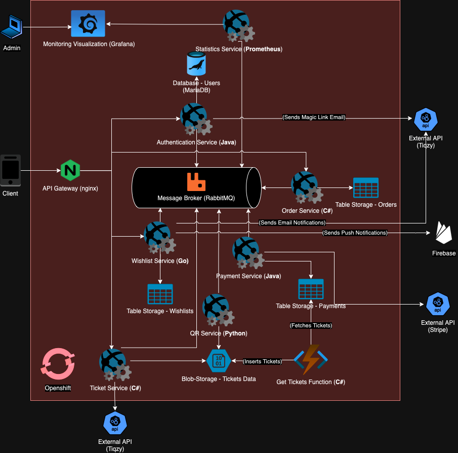

## Requirements
### Functional requirements

**Branded ticketing platform**: The app should be a branded ticketing platform that allows users to browse, purchase, and manage tickets for various events and attractions. The application will be available on both iOS and Android devices, and will be branded based on the reseller's preferences.

**Country and city selection**: Users should be able to select their country and city in the app to view tickets for events or attractions available in their area. These tickets will be grouped by activity type. For example, all tickets for boat activities in Amsterdam will be grouped together, and bus tours will also be grouped together differently.

**Ticket browsing and purchase**: The app must allow users to browse through available tickets, view details, and purchase tickets directly. It will also allow users to sort through tickets by activity, country, cities etc.

**Wishlist**: Users should be able to add tickets to a wishlist, to save them for later or to share with friends. This feature will help users keep track of tickets they are interested in and receive notifications when prices change or tickets become available.

**Payment integration**: The platform must integrate with Stripe for secure online payments, allowing users to pay for tickets easily and safely.

**API integration**: The system must connect to external ticket providers (via API) to automatically update ticket listings, prices, and availability in real-time. These APIs will also receive information from the businesses like museums which want to sell their tickets through the Tiqzy platform.

**Ticket Price Management**: The system must support different ticket pricing options, such as full price, discounted, or free tickets, depending on the reseller's preferences.

### Non-Functional requirements

**Scalability**: The application must scale horizontally, to accommodate a growing number of users and transactions without performance loss. To achieve this, load balancing will be implemented with the application to distribute traffic efficiently.

**Performance**: The application should perform well on any smartphone, with low loading speeds under normal network conditions. The overall user experience while navigating the application must be smooth, and interactions should be performed without lag.

**User-friendly design**: The app should be designed a simple and easy-to-use way, with a clean layout, drawing inspiration from other ticket (re)selling platforms like GetYourGuide or Tiqets.

**Security**: The application must protect all user data by using encryption (SSL/TLS) and secure authentication mechanisms (OAuth 2.0, JWT tokens). The payment processing, done through Stripe, must also implement security measures.

**Availability**: The app should be highly available and reliable, to ensure a minimum level of downtime. To achieve this, logging, error handling, and failover mechanisms will be implemented within the application.

**Integration with external platforms**: The application must integrate smoothly with external ticketing platforms via their APIs, to ensure easy and fast updates to ticket information.

**Localization**: The app should be able to support multiple countries and cities, and it should be adaptable to include more locations if needed. For each location, all tickets for all events located there should be featured on the page.

### Architecture Diagram

The architecture is a cloud-native microservices-based system built for scalability, modularity, and flexibility. It employs an Nginx API Gateway to route requests to loosely-coupled services such as Authentication (Java), Order (C#), Ticket (C#), and Payment (Java). These services communicate asynchronously through RabbitMQ, enabling event-driven interactions and reducing dependencies. Data is persisted across various storages, including MariaDB, blob storage, and table storage. External integrations include Stripe for payments and Firebase for push notifications. The system is deployed on OpenShift with Grafana/Prometheus for monitoring.